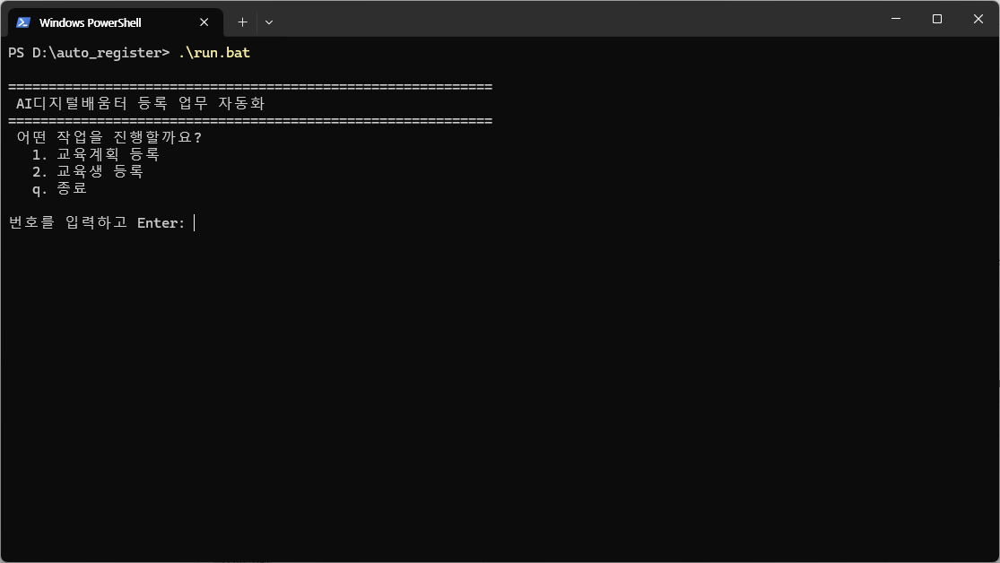
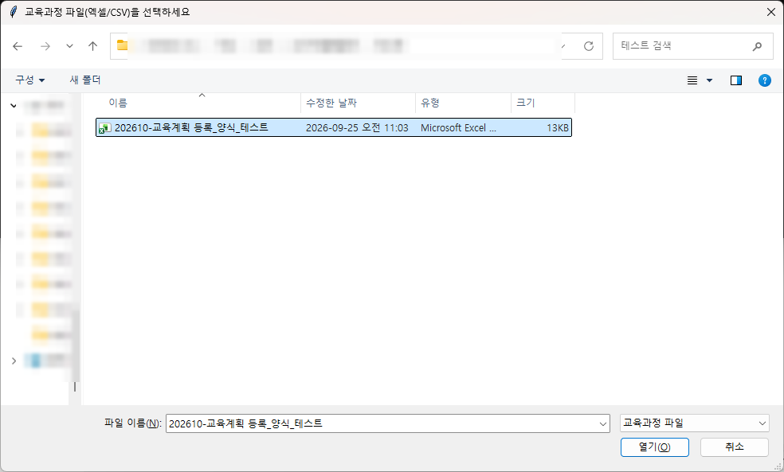
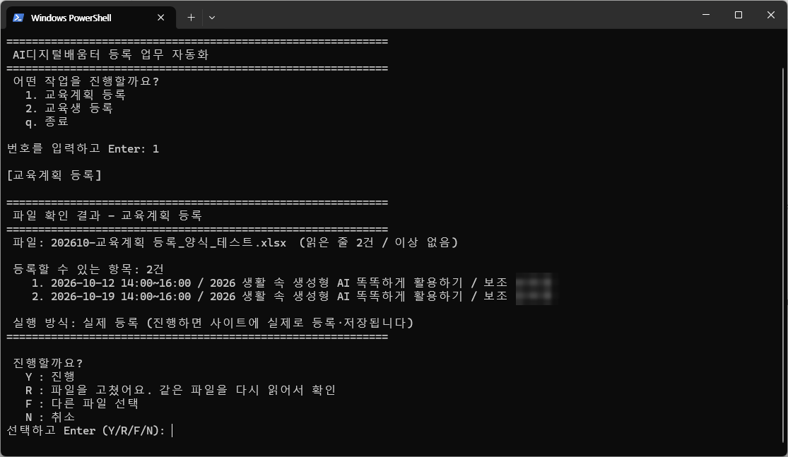
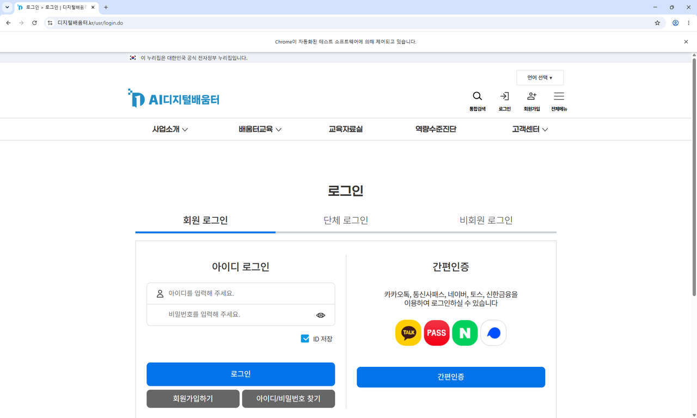
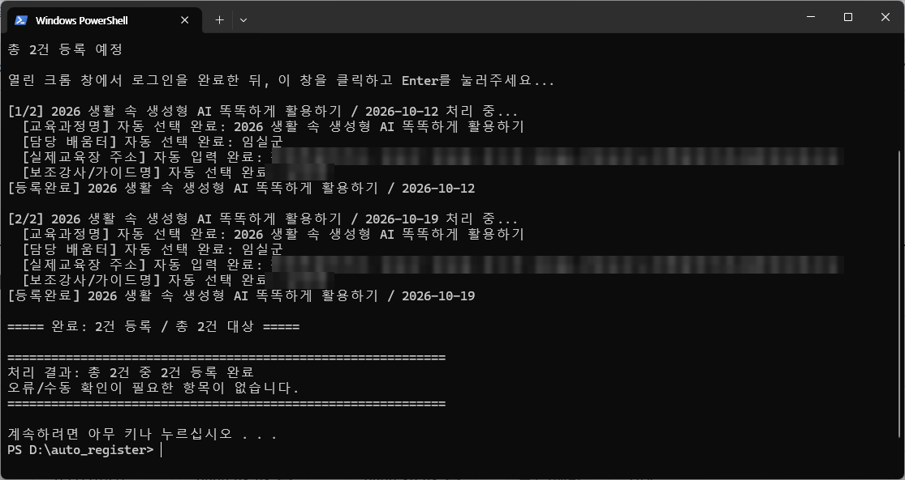
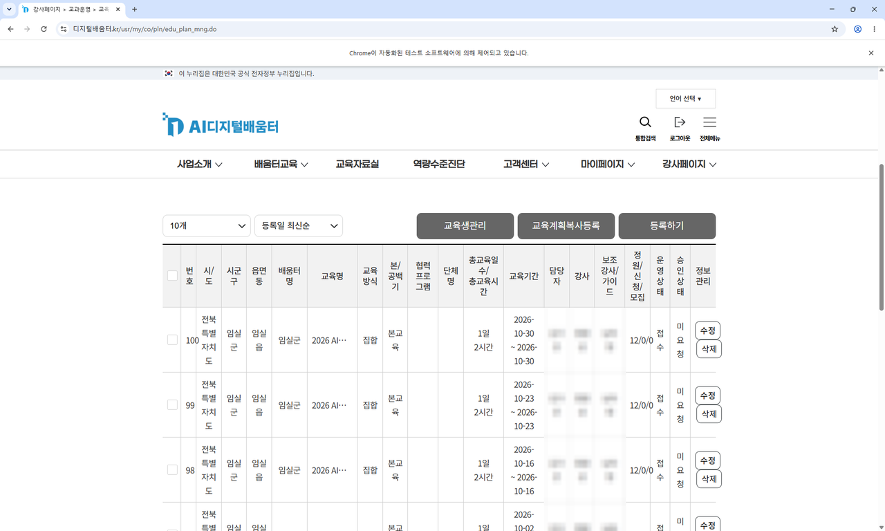

# AI디지털배움터 등록 업무 자동화 도구 (auto_register)

AI디지털배움터 강사페이지에서 손으로 하던 **두 가지 등록 업무**를 대신 해 주는 도구입니다.

| 번호 | 작업 | 자동으로 해 주는 일 |
|---|---|---|
| 1 | **교육계획 등록** | 엑셀(또는 CSV)에 적어 둔 교육과정을 '교육계획 관리'의 등록 화면에 한 줄씩 입력하고 등록 |
| 2 | **교육생 등록** | 엑셀(또는 CSV)에 적어 둔 교육생을 '교육실시 관리'의 교육생실시관리에 한 명씩 검색·선택·저장 |

`웹 자동화` · `Selenium` · `RPA`

> 비개발자가 Claude Code로 개발한 비공식 도구입니다. 사이트 화면이 바뀌면 동작하지 않을 수 있으며, 등록 결과의 확인과 책임은 사용자에게 있습니다.
>
> **등록이 끝나면 꼭 사이트에서 입력된 내용을 직접 확인하세요.** (교육계획은 '승인 요청'을 하기 전에 꼼꼼히 확인합니다)

## 이 도구가 하는 일

- 파일을 고르면 **먼저 내용을 검사해서 보여 줍니다.** (몇 건인지, 잘못된 줄은 어디인지) 확인하고 나서 진행 여부를 정합니다.
- 잘못된 줄이 있으면 **엔터를 눌러 계속 진행**해서 작업을 마친 후 수동 입력하거나, **엑셀을 고쳐서 다시 진행**할 수 있습니다.
- 자동으로 못 한 부분은 그 자리에서 멈추고 안내합니다. 안내대로 직접 처리하면 이어서 진행됩니다. (30초 안에 처리하지 않으면 다음 작업으로 넘어갑니다)
- 모두 끝나면 **직접 확인해야 할 항목만** 모아서 보여 주고 파일로도 저장합니다.
- 아이디와 비밀번호는 다루지 않습니다. **로그인은 항상 본인이 직접** 합니다.
- **(선택) 시험 모드:** 기본은 **실제로 등록**합니다. 어떻게 동작하는지 궁금하면 화면에 입력되는 모습만 보여 주고 **아무것도 등록하지 않는 '시험 모드'** 로 바꿔 연습해 볼 수 있습니다. ([시험 모드 안내](#선택-시험-모드로-연습해-보기))

## 준비물

- 배움터 **강사 권한이 있는 계정**
- Windows 10/11 PC, **Chrome(크롬) 브라우저**
- 교육과정 또는 교육생을 적은 엑셀(또는 CSV) 파일 → 만드는 법은 [2. 파일 준비](#2-파일-준비)
- 인터넷 연결
- Python은 **미리 설치하지 않아도 됩니다.** 설치 단계(`setup.bat`)에서 알아서 확인하고 없으면 설치합니다.

---

## 1. 설치 (처음 한 번만)

설치 방법은 세 가지입니다. **가장 쉬운 방법 A를 추천합니다.** 어느 방법이든 결과는 같습니다.

### 방법 A. ZIP 파일로 받기 (가장 쉬움, 추천)

1. 크롬에서 이 페이지(GitHub)를 엽니다.
2. 화면 위쪽의 초록색 **`Code`** 버튼을 누릅니다.
3. 열린 메뉴 맨 아래의 **`Download ZIP`** 을 누릅니다. 잠시 뒤 `auto_register-main.zip` 파일이 내려받아집니다.
4. **내려받은 파일 위치로 갑니다.** (보통 `내 PC > 다운로드` 폴더입니다. 크롬 오른쪽 위 다운로드 아이콘에서 '폴더 열기'를 눌러도 됩니다)
5. `auto_register-main.zip` 파일 위에서 **마우스 오른쪽 버튼**을 누르고 **`모두 압축 풀기...`** 를 누릅니다.
6. 나온 창에서 **`압축 풀기`** 버튼을 누릅니다. 잠시 뒤 `auto_register-main` 폴더가 열립니다.
   - ⚠️ **꼭 압축을 풀어야 합니다.** ZIP 파일을 더블클릭해서 열린 화면(압축 파일 안)에서 바로 실행하면 동작하지 않습니다.
7. 풀린 폴더를 **찾기 쉬운 곳으로 옮깁니다.** 예: `D:\auto_register-main` 또는 바탕화면
   - 폴더 경로가 너무 길거나 복잡하지 않은 곳이 좋습니다.
8. 폴더 안에서 **`setup.bat`** 을 **더블클릭**합니다.
   - 파란색 **"Windows의 PC 보호"** 창이 뜨면 **`추가 정보`** → **`실행`** 을 누릅니다. (인터넷에서 받은 파일이면 누구에게나 뜨는 일반적인 안내입니다)
9. 검은 창에서 설치가 저절로 진행됩니다. **1~3분** 걸립니다. 그 사이 창을 닫지 마세요.
10. 마지막에 초록색 글자로 **"설치가 끝났습니다"** 가 나오면 성공입니다. 아무 키나 눌러 창을 닫으세요.

### 방법 B. PowerShell에 붙여넣기 (명령어 방식)

컴퓨터에 `git`이 **없어도** 됩니다. 아래 순서대로 하세요.

1. 키보드의 **윈도우 키**를 누르고 `powershell` 이라고 입력합니다.
2. **`Windows PowerShell`** 이 나오면 클릭해서 엽니다. (파란색 또는 검은색 창이 열립니다)
3. 아래 **네 줄을 한꺼번에 복사**해서 창에 **붙여넣고 Enter**를 누릅니다. (창 안에서 마우스 오른쪽 버튼을 누르면 붙여넣기가 됩니다)

```powershell
cd ([Environment]::GetFolderPath('Desktop'))
Invoke-WebRequest https://github.com/youngseony/auto_register/archive/refs/heads/main.zip -OutFile auto_register.zip
Expand-Archive auto_register.zip -DestinationPath .
cd auto_register-main
```

4. 이어서 아래 한 줄을 붙여넣고 Enter를 누르면 설치가 시작됩니다. 1~3분 걸립니다.

```powershell
.\setup.bat
```

5. 초록색 글자로 **"설치가 끝났습니다"** 가 나오면 성공입니다.
6. 설치된 폴더는 **바탕화면의 `auto_register-main`** 입니다.

> `git`을 이미 쓰고 있다면 위 3번 대신 `git clone https://github.com/youngseony/auto_register.git` 후 `cd auto_register` 로 들어가도 같습니다.

### 방법 C. 클로드 데스크톱(또는 터미널)에게 맡기기

이미 **클로드 데스크톱(또는 터미널)** 을 쓰고 있다면, 아래 문장을 그대로 붙여넣어 요청할 수 있습니다.

```
https://github.com/youngseony/auto_register 를 내 바탕화면에 내려받아 압축을 풀고,
폴더 안의 setup.bat 을 실행해서 설치해 줘.
설치가 끝나면 run.bat 으로 실행하는 방법도 알려줘.
```

> 클로드에게 **배움터 아이디와 비밀번호는 절대 알려주지 마세요.** 로그인은 나중에 크롬 창에서 본인이 직접 합니다.

### 설치가 끝났다면

[2. 파일 준비](#2-파일-준비)로 넘어가 등록할 파일을 만들고, [3. 실행](#3-실행)을 따라 하면 됩니다.
**이 도구는 기본이 '실제 등록'입니다.** 등록 과정을 먼저 눈으로 보고 익히고 싶다면 [시험 모드로 연습해 보기](#선택-시험-모드로-연습해-보기)를 먼저 해 보세요.

### 설치가 안 될 때

| 증상 | 해결 |
|---|---|
| 검은 창에 빨간 글자로 `[오류]` 가 나온다 | 인터넷 연결을 확인하고 `setup.bat` 을 다시 더블클릭하세요. 계속되면 메시지를 캡처해서 [이슈](https://github.com/youngseony/auto_register/issues)로 남겨 주세요 |
| Python 설치 중 멈춘 것 같다 | 1~3분 기다려 보세요. 10분이 넘으면 창을 닫고 `setup.bat` 을 다시 실행하세요 |
| "Chrome을 찾지 못했습니다. 지금 설치할까요? (Y/N)" | `Y` 를 입력하고 Enter를 누르면 설치해 줍니다 |
| `setup.bat` 이 그냥 깜빡이고 닫힌다 | ZIP을 **압축을 풀지 않고** 실행한 경우입니다. 압축을 풀고 풀린 폴더 안의 `setup.bat` 을 실행하세요 |

---

## 2. 파일 준비

엑셀(`.xlsx`) 또는 CSV 파일에 한 줄에 하나씩 적습니다.

**규칙은 세 가지입니다.**

1. **1행은 제목(열 이름)** 입니다. 그대로 두고,
2. **2행부터** 내용을 적습니다.
3. 열 순서는 상관없고, 표에 없는 다른 열은 무시합니다. 엑셀에 시트가 여러 개여도 열 이름이 맞는 시트를 알아서 찾습니다.

처음에는 `샘플` 폴더의 파일을 **복사해서** 내용만 바꾸면 편합니다.

- `샘플\교육과정_양식.csv` → 교육계획 등록용
- `샘플\교육생_양식.csv` → 교육생 등록용

### 2-1. 교육과정 파일 (작업 1. 교육계획 등록)

| 열 이름 | 예시 | 설명 |
|---|---|---|
| 과정명 | 2026 ○○ 활용하기 | 사이트에 등록된 과정명과 **똑같이** 적습니다 |
| 일자 | 2026. 11. 03 | 엑셀 날짜 칸도, `2026. 11. 03` 같은 글자도 됩니다 |
| 시작 | 14:00 | 시작 시각 |
| 종료 | 16:00 | 끝나는 시각 |
| 담당 배움터 | 임실군 | 선택 사항. 비우거나 열이 없으면 `config.py`의 기본값을 씁니다 |
| 주소 | 전북특별자치도 임실군 임실읍 운수로 33-46 | 실제 교육장 주소 (주소 검색에 사용) |
| 상세주소 | //임실군노인종합복지관/2층정보화교실 | 실제 교육장 상세주소 |
| 시/도 | 전북특별자치도 | 실제 교육장 지역 선택에 사용 |
| 시군구 | 임실군 | 〃 |
| 읍면동 | 임실읍 | 〃 |
| 보조강사 | 홍길동 | 담당 배움터에 등록된 보조강사 이름 (**정확히 같아야** 합니다). 없으면 비워 둡니다. 열 이름에 `보조`가 들어 있으면(예: `보조1`) 같은 열로 읽습니다 |

- **비워 두면 안 되는 칸:** 과정명, 일자, 시작, 종료, 주소, 상세주소, 시/도, 시군구, 읍면동
- 잘못되었거나 빈 칸이 있는 줄은 자동 등록에서 **빠지고**, 확인 화면에 이유와 함께 나옵니다.

### 2-2. 교육생 파일 (작업 2. 교육생 등록)

| 열 이름 | 예시 | 설명 |
|---|---|---|
| 교육실시ID | E2600000001 | **꼭 필요합니다.** 어느 교육에 등록할지 정하고, 열린 교육이 맞는지 확인하는 데 씁니다. 사이트의 '교육실시 관리' 목록에서 확인할 수 있습니다 |
| 일자 | 2026. 09. 28 | 참고용 (확인 화면과 안내 문구에 요일과 함께 표시) |
| 요일 | 월 | 참고용. 비우면 일자로 계산합니다 |
| 과정명 | 2026 예시 교육과정명 | 참고용 |
| 기관명 | 예시복지관 | 참고용 |
| 이름 | 홍길동 | 회원ID·휴대폰이 없으면 이름으로 검색합니다. 있을 때는 검색된 이름이 같은지 다시 확인합니다 |
| 회원ID | example01 | **먼저 이 아이디로 검색**합니다 |
| 휴대폰 | 010-0000-0000 | 회원ID로 1명을 못 찾을 때 씁니다. 비회원도 찾을 수 있습니다. (휴대폰 번호 `010-1234-5678`은 `GUEST_01012345678`으로 검색합니다) (`전화번호`라는 열 이름도 됩니다) |

- **검색 순서:** 회원ID → 휴대폰 → (둘 다 비었을 때만) 이름. 그래도 1명을 못 찾으면 안내가 나옵니다.
- 같은 교육에 여러 명을 등록하려면 **같은 교육실시ID를 여러 줄에** 적습니다.
- 이름만 적으면 동명이인이 나올 수 있습니다.(수동 선택 필요) **가능하면 회원ID나 휴대폰을 함께 적으세요.**
- 필수 칸이 비었거나 형식이 틀린 줄, 같은 교육에 중복된 줄은 자동 등록에서 **빠지고**, 확인 화면에 이유와 함께 나옵니다.

### 파일 저장할 때 주의

- 엑셀은 **`.xlsx`** 로 저장하세요. CSV는 `CSV UTF-8` 또는 엑셀 기본 CSV 모두 됩니다.
- 실행할 때는 엑셀 파일을 **닫아 두세요.** 열려 있으면 읽지 못할 수 있습니다.
- 파일은 어디에 두어도 됩니다. 실행하면 파일 선택 창이 뜹니다.

---

## 3. 실행

### (선택) 시험 모드로 연습해 보기

이 도구는 **기본이 '실제 등록' 모드**입니다. `run.bat`으로 실행해 진행(Y)하면 **사이트에 실제로 등록·저장됩니다.**

**어떻게 동작하는지 궁금하신 분은 '시험 모드'로 변경하여 등록 과정을 연습하실 수 있습니다.**
시험 모드에서는 크롬에 입력되는 모습만 보여 주고 **등록/저장 버튼은 누르지 않으므로 아무것도 등록되지 않습니다.**
메뉴는 어떻게 고르는지, 확인 화면은 어떻게 보이는지, 로그인은 언제 하는지, 크롬에 입력되는 모습은 어떤지를 실제 업무 전에 미리 익힐 수 있습니다.

지금 어느 모드인지는 `run.bat` 실행 후 **파일 확인 화면의 `실행 방식`** 줄에서 볼 수 있습니다.

**방법 1. 클로드 코드 데스크톱에서 말로 바꾸기 (가장 쉬움)**

1. 클로드 코드 데스크톱에서 이 도구가 설치된 폴더를 엽니다. (예: `auto_register-main` 폴더)
2. 대화창에 아래처럼 입력합니다.
   ```
   시험 모드로 변경해주세요
   ```
3. 연습이 끝난 뒤 실제로 등록할 때는 아래처럼 입력합니다.
   ```
   실제 모드로 변경해주세요
   ```

**방법 2. 직접 파일을 고치기 (메모장)**

바꿀 파일은 **설치한 폴더 안의 `config.py`** 하나입니다. (예: `D:\auto_register-main\config.py`)

1. 설치한 폴더에서 **`config.py`** 를 **마우스 오른쪽 버튼**으로 누르고 **`연결 프로그램` → `메모장`** 을 고릅니다.
2. 메모장에서 **Ctrl + F**를 눌러 `DRY_RUN` 을 검색합니다.
3. 아래 줄을 찾습니다. (기본값입니다)
   ```python
   DRY_RUN = False
   ```
4. **시험 모드로 바꾸려면** `False` 를 **`True`** 로 고칩니다. (대문자 T, 나머지는 소문자, 따옴표 없음)
   ```python
   DRY_RUN = True
   ```
5. **Ctrl + S**로 저장하고 메모장을 닫습니다.
6. `run.bat` 을 실행하고, 파일 확인 화면에 **`실행 방식: 시험 모드`** 라고 나오는지 확인합니다.
7. **연습이 끝나면** 같은 방법으로 `DRY_RUN = True` 를 다시 **`DRY_RUN = False`** 로 되돌리고 저장합니다. 되돌리지 않으면 계속 시험 모드라서 아무것도 등록되지 않습니다.

---

### 3-1. 시작하기

1. 설치한 폴더를 엽니다. (`auto_register-main` 등)
2. **`run.bat`** 을 **더블클릭**합니다. 검은 창이 열립니다.
   - (또는 PowerShell에서 폴더로 이동한 뒤 `.\run.bat` 입력)

### 3-2. 작업 고르기

아래 메뉴가 나옵니다.

```
============================================================
 AI디지털배움터 등록 업무 자동화
============================================================
 어떤 작업을 진행할까요?
   1. 교육계획 등록
   2. 교육생 등록
   q. 종료

번호를 입력하고 Enter:
```

- **`1`** 을 입력하고 Enter → 교육계획 등록
- **`2`** 을 입력하고 Enter → 교육생 등록
- **`q`** 를 입력하고 Enter → 종료

(화면 사진은 바로 아래 3-3에 함께 있습니다.)

### 3-3. 파일 고르기

**파일 선택 창**이 뜹니다. 준비한 엑셀 또는 CSV 파일을 클릭하고 **`열기`** 를 누르세요. (여러 개를 함께 고를 수도 있습니다)

- 창이 안 보이면 **작업표시줄**에 깜박이는 아이콘이 있는지 확인하고 눌러 보세요.

<table>
<tr>
<td align="center"><br><sub>▲ 3-2. 작업 선택 메뉴</sub></td>
<td align="center"><br><sub>▲ 3-3. 파일 선택 창</sub></td>
</tr>
</table>

### 3-4. 확인 화면 보기 → 진행할지 정하기

파일을 읽으면 **검사 결과**가 나옵니다. **여기서는 아직 아무것도 등록되지 않았습니다.**



<sub>▲ 실제 화면 예시 (오류가 없는 경우, 교육계획 등록)</sub>

**교육생 등록**은 교육별로 몇 명인지 묶어서 보여 줍니다.

```
============================================================
 파일 확인 결과 - 교육생 등록
============================================================
 파일: 202609_교육생 등록.xlsx  (읽은 줄 34명 / 이상 없음)

 등록할 수 있는 항목: 34명
   교육 3개  (교육실시ID / 인원 / 일자 / 과정명 / 기관명)
   - E2600000001  13명  2026. 09. 28 (월) / 2026 ○○ 활용하기 / 예시복지관
   - E2600000002  12명  2026. 09. 29 (화) / 2026 △△ 배우기 / 예시노인복지관
   - E2600000003   9명  2026. 09. 30 (수) / 2026 △△ 배우기 / 예시경로당

 실행 방식: 실제 등록 (진행하면 사이트에 실제로 등록·저장됩니다)
============================================================
```

<sub>▲ 교육생 등록 확인 화면 예시 (교육실시ID·과정명·기관명은 예시로 바꾼 것입니다)</sub>

<details>
<summary>📷 오류가 있는 줄이 있을 때의 화면 예시 보기 (클릭)</summary>

```
============================================================
 파일 확인 결과 - 교육계획 등록
============================================================
 파일: 교육과정.xlsx  (읽은 줄 3건 / 오류 1건 제외)

 등록할 수 있는 항목: 2건
    1. 2026-11-03 14:00~16:00 / 2026 ○○ 활용하기 / 보조 홍길동
    2. 2026-11-04 10:00~12:00 / 2026 △△ 배우기

 [!] 오류가 있는 줄: 1건  (진행하면 이 줄은 자동 등록에서 제외됩니다)
   - 교육과정.xlsx 4행  2026 □□ 익히기 / 2026/13
       · '일자'을(를) 읽을 수 없습니다 (값: '2026/13', 예: 2026. 11. 03)
       · '상세주소'이(가) 비어 있습니다

 실행 방식: 실제 등록 (진행하면 사이트에 실제로 등록·저장됩니다)
============================================================

 진행할까요?
   Y : 진행 (오류가 있는 1줄은 제외하고 등록합니다)
   F : 다른 파일 선택
   N : 취소
선택하고 Enter (Y/F/N):
```

</details>

**읽는 방법**

| 부분 | 뜻 |
|---|---|
| 파일 … (읽은 줄 / 오류 제외) | 파일별로 몇 줄을 읽었고 그중 몇 줄이 잘못되었는지 |
| 등록할 수 있는 항목 | 실제로 등록할 목록입니다. **맞게 나왔는지 꼭 훑어보세요** |
| [!] 오류가 있는 줄 | 엑셀의 **몇 행**이 왜 잘못되었는지. 고치지 않고 진행하면 이 줄은 등록되지 않습니다 |
| [참고] | 잘못은 아니지만 살펴볼 것 (같은 줄이 두 번 있음, 이름만 있는 교육생 등) |
| 실행 방식 | 실제로 등록하는지, 시험 모드(등록 안 함)인지 |

**무엇을 누를까요?** (대문자·소문자 상관없고, 한글 자판 상태에서도 됩니다)

| 누를 글자 | 언제 | 하는 일 |
|---|---|---|
| **Y** | 내용이 맞을 때 | 등록을 시작합니다. 오류가 있는 줄은 **빼고** 진행합니다. (실제 모드에서는 **사이트에 실제로 등록**됩니다) |
| **F** | 다른 파일을 고르고 싶을 때 | 파일 선택 창이 다시 뜹니다 |
| **N** | 그만두고 싶을 때 | 아무것도 등록하지 않고 종료합니다 |

**오류 줄을 고치고 싶을 때**

1. **`N`** 을 눌러 종료합니다.
2. 엑셀에서 파일을 열어 화면에 나온 **행 번호**의 잘못된 칸을 고치고, **저장(Ctrl+S)** 한 뒤 엑셀 파일을 **닫습니다.**
3. `run.bat` 을 **새로 실행**해서 같은 파일을 다시 고릅니다. (다른 파일로 바꿔 보고 싶을 때만 **`F`**)

### 3-5. 로그인하기

**`Y`** 를 누르면 **크롬이 열리고 배움터 로그인 화면**이 나타납니다.

1. 크롬 창에서 **본인이 직접 로그인**합니다.
2. 로그인이 끝나면 **검은 창을 클릭**해서 돌아옵니다. (작업표시줄의 검은 창 아이콘을 눌러도 됩니다)
3. **Enter**를 누릅니다.

- 로그인하지 않고 Enter를 누르면 "아직 로그인 화면입니다"라고 다시 안내합니다.
- 크롬 위쪽의 **"Chrome이 자동화된 테스트 소프트웨어에 의해 제어되고 있습니다"** 는 **정상**입니다.
- 처음 한 번은 크롬 드라이버를 자동으로 준비하느라 몇 초 더 걸릴 수 있습니다.

<details>
<summary>📷 크롬에 열리는 로그인 화면 보기 (클릭)</summary>



</details>

### 3-6. 자동으로 등록되는 것 지켜보기

이제부터는 저절로 진행됩니다. **크롬 창을 닫거나 마우스·키보드로 건드리지 말고 지켜보세요.** (안내가 나올 때만 조작합니다)

**작업 1. 교육계획 등록**은 한 줄마다 과정 검색 → 시간표 → 접수기간 → 배움터 → 주소 → 보조강사 등을 채우고 `등록`을 누릅니다.
시험 모드에서는 한 줄을 채운 뒤 멈추고 "확인했으면 Enter"라고 물으니, 크롬 화면을 눈으로 확인하고 Enter를 누르세요.

**작업 2. 교육생 등록**은 교육실시ID로 '교육실시 관리' 목록에서 교육을 찾아 체크하고, 교육생마다 회원검색 → 선택 → 기자재 입력 → 저장을 합니다.
이미 등록된 교육생은 중복 등록하지 않고 건너뜁니다.
시험 모드에서는 저장 버튼 직전까지만 입력하고, 저장하지 않은 채 다음 교육생으로 넘어갑니다.

검은 창에는 한 명씩 처리되는 모습이 나옵니다. 아이디는 뒷부분을 `***` 로 가려서 보여 줍니다.

```
===== 교육실시ID E2600000001 (13명) =====
  [교육생실시관리] 팝업 열림: E2600000001
  이미 등록된 교육생 0명 확인

[1/34] E2600000001 / exa*** 처리 중...
  [회원검색] 자동 선택 완료 (아이디 검색): exa***
[등록완료] E2600000001 / exa***

[2/34] E2600000001 / hon*** 처리 중...
  [회원검색] 자동 선택 완료 (아이디 검색): hon***
[등록완료] E2600000001 / hon***
...
```

- **크롬 창은 끝날 때까지 닫지 마세요.** (최소화는 괜찮습니다) 등록 중에 창이 닫히면 "[중단] 자동 등록용 크롬 창이 닫혀서 더 진행할 수 없습니다" 가 나오고 멈춥니다.
- 자동으로 교육을 못 찾으면 **"[교육 선택]" 안내**가 나옵니다. 크롬의 '교육실시 관리' 목록에서 안내된 교육 **1개만** 체크한 뒤 검은 창으로 돌아와 Enter를 누르세요. (건너뛰려면 `s` + Enter)

### 3-7. `>>` 안내가 나왔을 때 (직접 처리하기)

자동으로 하지 못한 부분이 있으면 검은 창에 **`>>`로 시작하는 안내**가 나옵니다. 예:

```
  >> [담당 배움터] 자동 선택 실패. 브라우저에서 '임실군' 를 직접 검색/선택한 뒤 Enter를 눌러주세요...
```

1. 안내 문구를 읽습니다.
2. **크롬에서 그 칸만** 직접 고칩니다.
3. 검은 창을 클릭하고 **Enter**를 누르면 이어서 진행됩니다.

- **30초 안에** 처리하지 않거나, 처리하지 않고 그냥 Enter를 눌러도 다음 작업으로 넘어갑니다. (시간은 `MANUAL_WAIT_SECONDS`로 바꿀 수 있습니다)
- 직접 처리한 것 중 **화면에서 실제로 처리된 것이 확인된 항목만** 마지막 정리 목록에서 빠집니다. 애매하면 남겨서 다시 확인하게 합니다.

### 3-8. 결과 확인하기

모두 끝나면 결과가 나옵니다.



<sub>▲ 자동 등록이 진행되고 끝난 화면 (교육계획 등록 예시). 마지막의 "처리 결과" 부분이 결과 요약입니다.</sub>

**교육생 등록**이 모두 성공하면 이렇게 끝납니다.

```
===== 완료: 34명 등록 / 총 34명 대상 =====

============================================================
처리 결과: 총 34명 중 34명 등록 완료
  등록완료 34명
  전체 결과 파일: D:\auto_register\결과\등록결과_20260926_181221.csv
오류/수동 확인이 필요한 항목이 없습니다.
============================================================
```

- 직접 확인해야 할 항목이 있으면 그 목록이 나오고, 폴더 안 **`결과`** 폴더에 파일로도 저장됩니다.
  - `수동작업필요_날짜시각.csv` : 직접 확인하거나 등록해야 하는 항목과 이유
  - `등록결과_날짜시각.csv` : (교육생 등록만) 모든 교육생의 처리 결과와 오류 유형 (등록완료 / 이미등록 / 건너뜀 / 실패)
- **교육생 등록은 맨 마지막에 '오류 유형별 정리'가 나옵니다.** 저장하지 못한 교육생을 유형별(거주지역 미입력, 회원 검색·선택 실패, 저장 실패 등)로 묶어 `교육실시ID / 이름 / 오류내용`으로 보여 주니, 이 목록의 교육생만 직접 등록하면 됩니다.
- **크롬 창은 끝난 뒤에도 그대로 열려 있습니다.** 등록된 내용을 사이트에서 직접 확인하세요.
  - 교육계획: '교육계획 관리' 목록에서 확인하고 **'승인 요청'** 을 진행합니다.
  - 교육생: '교육실시 관리' 목록에서 교육을 체크하고 '교육생실시관리'를 눌러, 열린 **'교육생관리(실시)'** 팝업의 목록에서 확인합니다. 새로 등록된 교육생은 신청일이 오늘 날짜로 나옵니다.

<details>
<summary>📷 사이트에 등록된 교육계획 목록 화면 보기 (클릭)</summary>



<sub>▲ '교육계획 관리' 목록에 새로 등록된 줄이 보입니다. 승인상태는 '미요청'이며, 확인한 뒤 '승인 요청'을 진행합니다.</sub>

</details>

**실행 중 주의**

- 중간에 멈추려면 검은 창을 클릭하고 **`Ctrl + C`** 를 누릅니다. 지금까지의 결과는 정리해 줍니다.- `결과` 폴더의 파일과 `auto_register.log` 에는 교육·교육생 정보가 들어 있으니 **다른 사람이나 인터넷에 올리지 마세요.** (GitHub에도 올라가지 않게 설정되어 있습니다)

---

## 4. 오류가 발생하면

자동으로 입력한 부분을 제외하고, 남은 부분은 직접 입력하면 됩니다. **등록된 내용이 정확한지 꼭 확인하세요.**

| 증상 | 확인할 것 |
|---|---|
| "필요한 열이 없습니다" | 파일 1행(제목)의 열 이름이 [2. 파일 준비](#2-파일-준비)의 표와 똑같은지 확인하세요. 현재 제목이 화면에 함께 나옵니다. 고친 뒤 프로그램을 새로 시작하세요 |
| 확인 화면에 "오류가 있는 줄" | 안내된 **행 번호**의 일자(예: `2026. 11. 03`)·시간(예: `14:00`)·빈 칸을 고친 뒤 프로그램을 새로 시작하세요. 그냥 진행(Y)하면 그 줄은 빠지니 직접 등록하세요 |
| "파일을 읽을 수 없습니다" / "엑셀 파일을 열 수 없습니다" | 엑셀에서 그 파일이 열려 있으면 닫고 프로그램을 새로 시작하세요. 계속되면 엑셀에서 `.xlsx`로 다시 저장해 보세요 |
| "등록할 수 있는 항목이 없어 진행할 수 없습니다" | 모든 줄에 오류가 있는 경우입니다. 안내를 보고 고친 뒤 프로그램을 새로 시작하세요 |
| "Chrome을 시작하지 못했습니다" | Chrome이 설치되어 있는지, 인터넷에 연결되어 있는지 확인하세요 |
| "자동 선택 실패" 안내 (교육계획) | 과정명·배움터·보조강사 이름이 사이트에 등록된 것과 **정확히** 같은지 확인하세요 |
| "열린 팝업의 교육이 파일의 교육실시ID와 다릅니다" (교육생) | 파일의 ID가 오타이거나 다른 교육을 체크한 것입니다. 팝업을 닫고 안내된 교육을 다시 체크하세요 |
| "거주지역 선택이 비어 있습니다" 또는 사이트 안내 "거주지역 시군구를 선택해주십시요" (교육생) | 그 회원이 회원가입 때 **거주지역(시/도, 시군구)** 을 입력하지 않은 경우입니다. 이 항목이 비면 사이트가 저장을 막습니다. 기다리지 않고 그 교육생만 건너뛰고, 맨 마지막 **"오류 유형별 정리"** 의 `거주지역 미입력` 목록에 나옵니다. 그 교육생은 크롬의 교육생등록 화면에서 거주지역을 선택해 직접 등록하세요. (건너뛰지 않고 직접 선택하도록 기다리게 하려면 `ERROR_ACTION = "wait"`) |
| 회원검색 "0건" / "2건 이상" (교육생) | 회원ID(또는 휴대폰)가 맞는지 확인하세요. 동명이인은 회원ID로 다시 등록하세요 |
| "저장 후 교육생 목록에서 확인되지 않습니다" (교육생) | 화면의 안내 메시지(정원 초과 등)를 확인하고 직접 저장하세요 |
| "크롬 창과 연결이 끊겼습니다. 크롬을 새로 열 테니…" (로그인할 때) | 로그인을 기다리는 동안 크롬 창이 닫힌 경우입니다. 새로 열린 크롬 창에서 다시 로그인하고 Enter를 누르면 이어서 진행됩니다 |
| "자동 등록용 크롬 창이 닫혀서 더 진행할 수 없습니다" (등록 중) | 등록하는 도중에 크롬 창이 닫힌 경우입니다. `run.bat` 을 다시 실행하고, 끝날 때까지 크롬 창을 닫지 마세요. (이미 등록된 교육생은 건너뜁니다) |
| "Ctrl+C 가 눌려 프로그램을 멈췄습니다" | 검은 창에서 `Ctrl + C` 가 눌린 경우입니다. `run.bat` 을 다시 실행하세요 |
| "예상하지 못한 문제가 생겨 중단되었습니다" | 화면의 내용과 폴더 안 `auto_register.log` 파일을 이슈로 남겨 주세요. 그때까지 등록된 내용은 크롬의 목록에서 확인할 수 있습니다 |
| 사이트가 개편되어 항목을 못 찾는 경우 | `auto_register.log`의 메시지와 함께 [이슈](https://github.com/youngseony/auto_register/issues)로 남겨 주세요 |

## 5. 설정 바꾸기 (선택)

기본값은 `config.py` 파일을 **메모장으로 열어** 바꿉니다. 초보자는 건드리지 않아도 됩니다. (바꾼 뒤에는 꼭 저장하세요)

**공통 설정**

| 설정 | 의미 |
|---|---|
| `DRY_RUN` | `False`면 **실제 등록**(기본값), `True`면 **시험 모드**(입력까지만 하고 등록/저장은 안 함). [시험 모드 안내](#선택-시험-모드로-연습해-보기) |
| `TEST_LIMIT` | 앞에서 N건(N명)만 처리합니다. `None`이면 전부 처리합니다 |
| `AUTO_SUBMIT` | `True`면 등록/저장까지 자동, `False`면 한 건마다 화면을 확인하고 Enter로 등록 |
| `MANUAL_WAIT_SECONDS` | `>>` 안내 후 기다리는 시간(초, 기본 30). `0`이면 Enter를 누를 때까지 무제한 대기 |
| `WAIT_TIME` / `DELAY_BETWEEN_ACTIONS` | 화면을 기다리는 시간 / 작업 사이 쉬는 시간(초). 사이트가 느리면 늘려 보세요 |

**교육계획 등록 설정**

| 설정 | 의미 |
|---|---|
| `PLAN_DEFAULT_VALUES` | 모든 과정에 똑같이 넣는 값: 교육정원(15), 교육대상자유형(고령층), 취약계층 해당, 사용기자재(스마트폰), 담당 배움터 기본값 |
| `RCEPT_BGN_DATE` | 접수 시작일. `None`이면 교육일이 속한 달의 1일로 자동 지정됩니다 (다음 달에도 고칠 필요 없음) |

**교육생 등록 설정**

| 설정 | 의미 |
|---|---|
| `STUDENT_DEFAULT_VALUES` | 모든 교육생에게 넣는 값: 교육보유기자재(스마트폰), 양방향영상교육가능(불가능) |
| `COURSE_SELECT_MODE` | `"auto"`(기본): 교육실시ID로 목록에서 교육을 찾아 체크까지 자동, 못 찾으면 안내 / `"manual"`: 처음부터 사용자가 교육을 체크 |
| `ERROR_ACTION` | (교육생 등록에만 적용) 예상하지 못한 오류(거주지역 미입력 같은 회원 정보 부족, 사이트 안내창, 저장 확인 실패, 처리 중 오류)를 만났을 때: `"skip"`(기본) 기다리지 않고 건너뛰고 마지막 "오류 유형별 정리"에 모아 알려줌 / `"wait"` 직접 처리하도록 `MANUAL_WAIT_SECONDS` 동안 기다림 |
| `EQUIPMENT_IDS` 등 | 화면 요소 ID. 사이트가 개편되면 여기만 고치면 됩니다 |

## 6. 다음에 또 쓸 때

- 설치는 **다시 할 필요가 없습니다.** 새 엑셀 파일만 준비해서 **`run.bat` → 작업 선택 → 3. 실행**을 하면 됩니다.
- **새 버전**이 올라오면: 새 ZIP을 받아 새 폴더에 풀고 `setup.bat`을 실행하세요. 바꿔 둔 설정이 있다면 옛 폴더의 `config.py`를 참고해서 다시 바꿔 주세요.

## 참고: 자동으로 입력하는 항목

- **교육계획 등록:** 교육과정명(검색·선택) · PC/모바일=모바일 · 교육시간표(1일차만 남기고 날짜·시간·사용기자재) · 접수기간 · 교육일자 · 담당 배움터(검색·선택) · 실제교육장(직접입력: 주소검색 창에서 주소 선택 + 상세주소, 시/도/시군구/읍면동) · 보조강사/가이드명(검색·선택) · 교육정원 · 교육대상자유형 · 취약계층 해당. 그 밖의 항목(교육방식 등)은 사이트 기본값 그대로 등록됩니다.
- **교육생 등록:** 교육실시 관리 목록의 표시 개수를 100으로 늘려 교육실시ID로 교육 찾기·체크 → 교육생실시관리 열기(열린 교육이 파일의 ID와 같은지 확인) → 이미 등록된 교육생 확인 → 교육생등록 → 회원검색(회원ID → 휴대폰 → 이름) → 교육보유기자재 `스마트폰` 체크 · 양방향영상교육가능 `불가능` 선택 → 저장 → 교육생 목록에 반영됐는지 확인.

## 개발 참고

```
auto_register/
├─ run.bat            실행 (작업 선택 메뉴)
├─ setup.bat, setup.ps1   처음 한 번 설치 (Python, 가상환경, 라이브러리, Chrome 확인)
├─ main.py            메뉴 + 파일 확인 요약 + 진행 확인(Y/F/N)
├─ config.py          설정 (공통 / 교육계획 / 교육생)
├─ common/            두 작업이 함께 쓰는 코드 (입력 대기·로그, 파일 읽기, 결과 정리, 크롬 조작)
├─ tasks/edu_plan.py  작업 1. 교육계획 등록
├─ tasks/student.py   작업 2. 교육생 등록
├─ 샘플/              파일 양식 예시
├─ images/            README에 쓰는 화면 사진
└─ 결과/              실행 결과 파일 (자동 생성, GitHub에는 올라가지 않음)
```

- 명령줄에서 메뉴를 건너뛰려면: `venv\Scripts\python.exe main.py plan` (교육계획) / `main.py student` (교육생)

## 라이선스

[MIT License](LICENSE) - 누구나 자유롭게 사용, 수정, 배포할 수 있습니다. 다만 프로그램은 어떠한 보증 없이 "있는 그대로" 제공됩니다.
